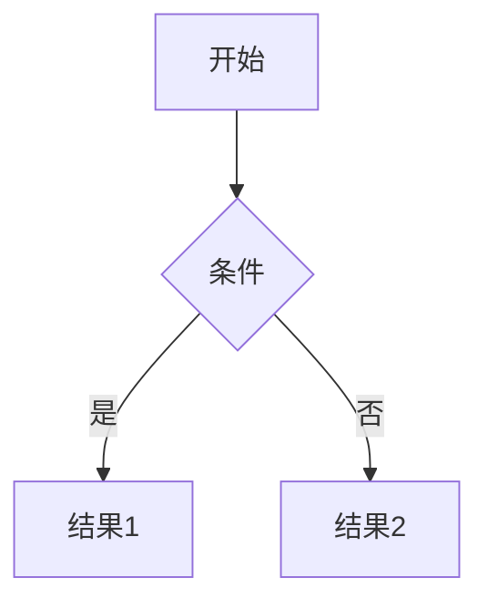

# Aria

Aria 是一个干净、响应式、功能丰富的 Hugo 博客主题，具有现代设计和增强的用户体验。

## 特点

- 响应式设计，在各种设备上都有良好表现
- 干净简约的博客布局
- 明暗模式切换，带有精美的灯泡动画效果
- 移动端导航菜单带有毛玻璃效果
- 自定义 About 页面布局
- 支持演讲（Talks）内容类型
- 支持简历（Resume）页面
- 优化的导航体验
- 社交媒体图标集成
- 搜索功能
- 标签和归档支持
- 代码高亮
- **本地化的第三方库支持**（KaTeX 数学公式、Mermaid 图表）
- **按需加载优化**（仅在需要时加载特定资源）

## 安装

```bash
# 在你的 Hugo 站点根目录下
git clone https://github.com/sullivan980/Aria.git themes/Aria
```

然后在你的 `hugo.toml` 或 `config.toml` 文件中设置：

```toml
theme = "Aria"
```

## 配置

### 基础配置

```toml
# 主题特定配置
[params]
  # 基本设置
  title = "站点标题"
  description = "站点描述"
  
  # 主题设置
  defaultTheme = "auto"  # 可选: light, dark, auto
  
  # 数学公式支持（全局配置）
  [params.math]
    enable = false  # 设为true全局启用，或在单独文章中启用
  
  # 图表支持（全局配置）
  [params.diagram]
    enable = false  # 设为true全局启用，或在单独文章中启用
```

### 在单独文章中启用特定功能

在文章的前置参数中添加以下配置可以启用数学公式或图表功能：

```yaml
---
title: "文章标题"
math: true    # 启用数学公式
diagram: true # 启用图表
---
```

### 编写数学公式

```markdown
行内公式: $E=mc^2$

单独公式:
$$
\begin{pmatrix} 
a & b \\
c & d 
\end{pmatrix}
$$
```

### 创建图表

```markdown

```

## 性能优化

Aria主题已经对性能进行了多种优化：

1. **按需加载** - 只有在需要时才加载特定资源
2. **资源本地化** - 第三方库已本地化，减少外部依赖
3. **资源指纹** - 启用资源指纹和缓存控制
4. **懒加载** - 图片和其他资源采用懒加载策略

## 目录结构

Aria主题采用清晰的目录结构组织代码：

```
themes/Aria/
├── assets/           # 主题资源文件
│   ├── css/          # CSS样式
│   │   ├── core/     # 核心样式变量
│   │   ├── common/   # 通用组件样式
│   │   ├── features/ # 功能特性样式
│   │   ├── includes/ # 包含文件
│   │   └── extended/ # 用户扩展样式
│   └── js/           # JavaScript文件
│       ├── core/     # 核心JS功能
│       └── libs/     # 第三方库
├── archetypes/       # 内容模板
├── i18n/             # 国际化文件
├── layouts/          # 布局模板
└── static/           # 静态资源
```

## 许可证

本主题基于 MIT 许可证发布，详情请参阅 [LICENSE](LICENSE) 文件。

## 致谢

Aria 主题基于 [PaperMod](https://github.com/adityatelange/hugo-PaperMod) 主题开发，感谢原作者的出色工作。
